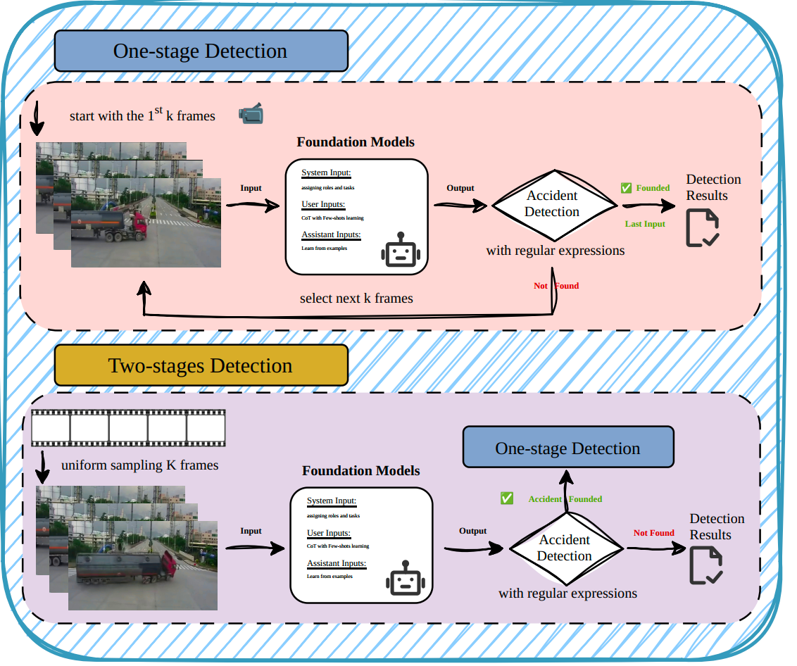

# Traffic Accident Detection from Surveillance and Dashcam Videos: An Empirical Study Using Foundation Models
## Intro
Road traffic accidents remain a major global safety concern. Automatically detecting accidents from surveillance and dashcam videos is important for rapid emergency response and for discovering safety-critical corner cases for autonomous driving validation.

Recent multimodal foundation models demonstrate strong cross-modal understanding and reasoning capabilities. In this work, we investigate their potential for traffic accident detection, focusing on multi-modal large language models (MLLMs) and video–language models (VLMs). We propose a training-free detection framework with one-stage and two-stage strategies for image and video inputs, respectively, using few-shot prompting without large-scale accident video training.
## Solution Architecture

